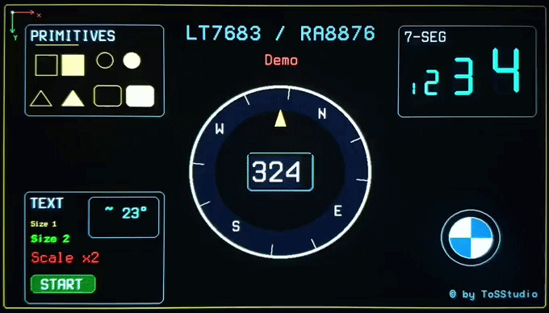

# LT7683 / RA8876 Graphics Library



Lightweight graphics library for **LT7683 / RA8876 TFT controllers** on Arduino-compatible platforms.

Designed for **performance, clarity, and minimal overhead**, with direct register access and fast primitives.

---

## ✨ Features

* Fast drawing primitives:

  * Lines, rectangles, circles, triangles, arcs
* Filled shapes and rounded rectangles
* Text rendering with size and scale control
* 7-segment display helpers
* RGB color control (foreground / background)
* Optimized for SPI-driven displays
* Minimal dependencies (Arduino + SPI)

---

## 🧪 Demo

The included demo showcases:

* Smooth rotating compass bezel
* Digital COG (course over ground)
* Primitive drawing examples
* Text rendering (size + scaling)
* 7-segment display
* Simple UI elements

Find it here:

examples/LT7683_Demo/LT7683_Demo.ino

---

## 🚀 Getting Started

```cpp
#include <LT7683.h>

LT7683 tft(CS_PIN, RST_PIN);

void setup() {
  SPI.begin();
  tft.begin();

  tft.back(0, 0, 0);
  tft.fore(255, 255, 255);

  tft.circle(200, 200, 50);
}

void loop() {
}
```

---

## 🧩 API Overview

### Initialization

```cpp
LT7683 tft(CS_PIN, RST_PIN);
```

* `CS_PIN`  → SPI chip select
* `RST_PIN` → display reset

---

### Print Compatibility

The library inherits from Arduino's `Print` class.

This allows usage of:

* `print()`
* `println()`
* `write()`

Example:

```cpp
tft.setCursor(100, 100);
tft.print("Hello");
```

---

### Drawing Primitives

* `line()`
* `rect()`, `fillRect()`
* `circle()`, `fillCircle()`
* `triangle()`, `fillTriangle()`
* `arc()`, `fillArc()`

---

### Text

* `textSize()`
* `textScale()`
* `setCursor()`
* `write()`, `print()`

---

### Colors

* `fore(r, g, b)`
* `back(r, g, b)`

---

### 7-Segment Rendering

7-segment digits are rendered using primitives and are not part of `Print`.

Example:

```cpp
tft.set7SegScale(2);
tft.plot7Seg(200, 200, 5);
```

Features:

* Fully scalable
* No font required
* Clean rendering at large sizes

---

## 🧠 Controller Notes

The LT7683 (RA8876-compatible) is a hardware graphics controller.

* All drawing operations are executed on the controller itself
* The MCU only sends commands (not pixels)
* This enables smooth animations even on slower MCUs

Coordinate system:

* Origin: top-left (0,0)
* X → right
* Y → down

---

## ⚡ Interface & Performance

* SPI interface (tested on SAMD21, ATmega32u4, ATtiny)
* Stable operation at typical Arduino SPI speeds
* No framebuffer required on MCU side

---

## 🔢 7-Segment Rendering Details

The 7-segment renderer is built entirely from drawing primitives.

* No bitmap fonts
* Resolution independent
* Suitable for very large digits (tested up to high scaling factors)

---

## 🔌 Wiring (basic)

Typical SPI wiring:

* MOSI → Display MOSI
* SCK  → Display SCK
* CS   → Chip Select
* RST  → Reset

Refer to your specific LT7683 board for exact pinout.

---

## 🧪 Tested Platforms

* SAMD21 (Feather M0)
* ATmega32u4
* ATtiny (I2C/SPI variants)

---

## 🧱 Structure

```
src/        → library source files
examples/   → demo sketches
docs/       → images / GIFs
```

---

## 📄 License

MIT License

---

## ©

© ToSStudio
